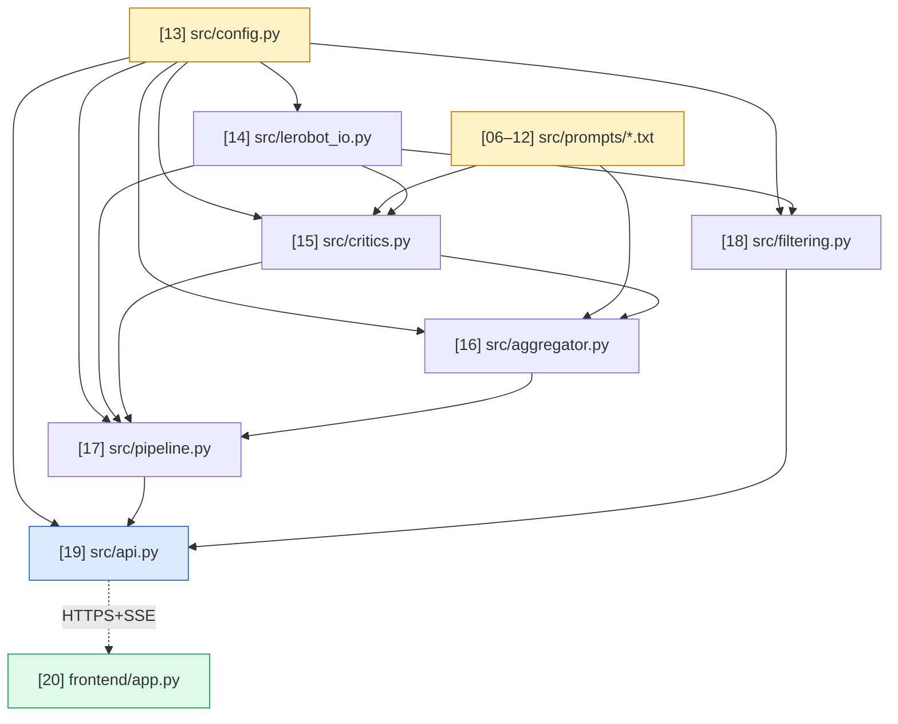

# Crucible — Codebase Birth Map

A visual, chronological map of how the Crucible codebase came into existence.
This document has **two views** of the same 49 files:

- **Section 2 — Chronological**: 27 build phases in the exact order they happened, each with the files added, the directories first created, what they unblock, and why the phase happened when it did. Every file gets a birth number `[NN]` from `[01]` (oldest) to `[49]` (newest).
- **Section 3 — Structural**: the final directory tree with each file annotated by its `[NN]` birth number, so you can navigate by location and instantly find the phase that birthed it.

Sections 4–6 add a dependency graph, three suggested reading paths, and a phase-timing table.

If you read Section 2 top-to-bottom and then Section 3, you'll never hit a forward reference.

---

## Section 2 — The 27 phases

The build splits into two acts. **Act I** (phases 01–18) is the original feature build. **Act II** (phases 19–27) is the post-research hardening pass: five parallel research agents flagged five separate problems with the original build, and the fixes landed in their own commits so the diff history stays auditable.

### Act I — Build (phases 01 → 18)

```
PHASE 01 ─ 98ea995 ─ chore: initial project scaffold
─────────────────────────────────────────────────────────────────
NEW DIRECTORIES:  src/
NEW FILES:        [01] pyproject.toml
                  [02] .gitignore
                  [03] .dockerignore
                  [04] .env.example
                  [05] src/__init__.py
UNBLOCKS:         every Python module that needs deps; every
                  directory under src/
WHY NOW:          you can't import anything until the package and
                  the deps are declared
```

```
PHASE 02 ─ 71ae815 ─ feat(prompts): five critic + aggregator system prompts
─────────────────────────────────────────────────────────────────
NEW DIRECTORIES:  src/prompts/
NEW FILES:        [06] src/prompts/__init__.py
                  [07] src/prompts/critic_visual.txt
                  [08] src/prompts/critic_kinematic.txt
                  [09] src/prompts/critic_task.txt
                  [10] src/prompts/critic_strategy.txt
                  [11] src/prompts/critic_safety.txt
                  [12] src/prompts/aggregator.txt
UNBLOCKS:         critics.py and aggregator.py (they read these)
WHY NOW:          these six text files ARE the product. Everything
                  else is plumbing to deliver them to a model and
                  capture the response. Write the rubric first.
```

```
PHASE 03 ─ b5d3f5d ─ feat(config): runtime configuration
─────────────────────────────────────────────────────────────────
NEW DIRECTORIES:  (none)
NEW FILES:        [13] src/config.py
UNBLOCKS:         every src/* module (all import CrucibleConfig)
WHY NOW:          one source of tunables before any module that
                  has knobs gets written
```

```
PHASE 04 ─ 3b239a4 ─ feat(io): streaming LeRobot dataset reader
─────────────────────────────────────────────────────────────────
NEW DIRECTORIES:  (none)
NEW FILES:        [14] src/lerobot_io.py
UNBLOCKS:         critics, pipeline, filtering (consume EpisodeBundle)
WHY NOW:          need data flowing in before you can score it
NOTE:             this initial version assumed v2 layout; rewritten
                  in PHASE 19 after agent research
```

```
PHASE 05 ─ 3267e75 ─ feat(critics): five Qwen3-VL critics
─────────────────────────────────────────────────────────────────
NEW DIRECTORIES:  (none)
NEW FILES:        [15] src/critics.py
UNBLOCKS:         aggregator (reuses _chat_with_retries +
                  _extract_json_loose), pipeline (run_all_critics)
WHY NOW:          data is now flowing in; time to send it to a model
NOTE:             json_schema + xgrammar mode added in PHASE 21
```

```
PHASE 06 ─ f79d4e3 ─ feat(aggregator): weighted aggregator
─────────────────────────────────────────────────────────────────
NEW DIRECTORIES:  (none)
NEW FILES:        [16] src/aggregator.py
UNBLOCKS:         pipeline
WHY NOW:          5 critic outputs need to be fused into one
                  KEEP/POLISH/REJECT verdict
```

```
PHASE 07 ─ 0b90118 ─ feat(pipeline): end-to-end orchestrator
─────────────────────────────────────────────────────────────────
NEW DIRECTORIES:  (none)
NEW FILES:        [17] src/pipeline.py
UNBLOCKS:         api.py, scripts/precache_demo.py,
                  scripts/one_shot_test.py
WHY NOW:          every component now exists; compose them
                  end-to-end with cache + timeouts
```

```
PHASE 08 ─ bf1366c ─ feat(filtering): threshold + push-to-Hub
─────────────────────────────────────────────────────────────────
NEW DIRECTORIES:  (none)
NEW FILES:        [18] src/filtering.py
UNBLOCKS:         api (push_filtered endpoint)
WHY NOW:          pipeline produces results; user needs to do
                  something useful with them — push curated
                  subset back to Hub
NOTE:             v3 metadata mirroring added in PHASE 22
```

```
PHASE 09 ─ e16456f ─ feat(api): FastAPI + SSE
─────────────────────────────────────────────────────────────────
NEW DIRECTORIES:  (none)
NEW FILES:        [19] src/api.py
UNBLOCKS:         docker entrypoint (boots api), frontend
                  (talks to api over HTTPS)
WHY NOW:          we have a complete pipeline + filter; expose
                  them as HTTP endpoints with SSE progress stream
```

```
PHASE 10 ─ 3617d11 ─ feat(frontend): Gradio Space frontend
─────────────────────────────────────────────────────────────────
NEW DIRECTORIES:  frontend/
NEW FILES:        [20] frontend/app.py
                  [21] frontend/requirements.txt
                  [22] frontend/README.md   (HF Space front-matter)
UNBLOCKS:         deploy_space.sh
WHY NOW:          API exists; build something users can click
```

```
PHASE 11 ─ 508b3b8 ─ feat(scripts): smoke + precache + deploy
─────────────────────────────────────────────────────────────────
NEW DIRECTORIES:  scripts/
NEW FILES:        [23] scripts/one_shot_test.py
                  [24] scripts/precache_demo.py
                  [25] scripts/deploy_space.sh
UNBLOCKS:         pre-cache demo runs, manual smoke testing,
                  Space deployment
WHY NOW:          building blocks exist; add ergonomic CLIs
                  over them for hackathon-day operators
```

```
PHASE 12 ─ 43f624d ─ feat(docker): MI300X container
─────────────────────────────────────────────────────────────────
NEW DIRECTORIES:  docker/
NEW FILES:        [26] docker/Dockerfile.gpu
                  [27] docker/entrypoint.sh
UNBLOCKS:         actually running on a GPU box
WHY NOW:          code is feature-complete; package it for
                  the AMD MI300X droplet
NOTE:             base image + vllm flags fixed in PHASE 20
```

```
PHASE 13 ─ 97a2713 ─ test: 40 unit tests
─────────────────────────────────────────────────────────────────
NEW DIRECTORIES:  tests/
NEW FILES:        [28] tests/__init__.py
                  [29] tests/conftest.py
                  [30] tests/test_aggregator.py     (10 tests)
                  [31] tests/test_critics_json.py   (7 tests)
                  [32] tests/test_telemetry.py      (10 tests)
                  [33] tests/test_filtering.py      (5 tests)
                  [34] tests/test_imports.py        (8 tests)
UNBLOCKS:         CI workflow, regression-proof refactors
WHY NOW:          code is feature-complete; lock down the
                  deterministic logic before changing anything
```

```
PHASE 14 ─ ce2f34d ─ ci: GitHub Actions
─────────────────────────────────────────────────────────────────
NEW DIRECTORIES:  .github/, .github/workflows/
NEW FILES:        [35] .github/workflows/test.yml
UNBLOCKS:         tests run automatically on every push to main
WHY NOW:          tests exist; automate them
```

```
PHASE 15 ─ 8145b26 ─ docs: hackathon documentation set
─────────────────────────────────────────────────────────────────
NEW DIRECTORIES:  docs/, eval/
NEW FILES:        [36] docs/SUBMISSION.md
                  [37] docs/architecture.md
                  [38] docs/build_in_public.md
                  [39] docs/demo_script.md
                  [40] docs/pitch.md
                  [41] eval/manual_check.md
UNBLOCKS:         submission day
WHY NOW:          features and tests done; write the words
                  that judges will actually read
NOTE:             pitch.md reframed in PHASE 24 after agent
                  research showed our positioning was wrong
```

```
PHASE 16 ─ 777f6d1 ─ chore: MIT LICENSE
─────────────────────────────────────────────────────────────────
NEW DIRECTORIES:  (none)
NEW FILES:        [42] LICENSE
UNBLOCKS:         legal clarity for redistribution
WHY NOW:          before pushing the repo public
```

```
PHASE 17 ─ 379da31 ─ chore: Makefile
─────────────────────────────────────────────────────────────────
NEW DIRECTORIES:  (none)
NEW FILES:        [43] Makefile
UNBLOCKS:         single command to install/lint/test/serve/deploy
WHY NOW:          enough commands across docs that a cheat
                  sheet earns its keep
```

```
PHASE 18 ─ e1f8744 ─ docs: top-level README
─────────────────────────────────────────────────────────────────
NEW DIRECTORIES:  (none)
NEW FILES:        [44] README.md
UNBLOCKS:         first impression on GitHub + lablab judges
WHY NOW:          all the content the README references now
                  exists; write the front door last
NOTE:             reframed PHASE 24, link-updated PHASE 27
```

**End of Act I.** 44 files, 18 phases, 0 known bugs at this point. Then five
parallel research agents found five separate problems and I patched them all
before pushing to GitHub.

---

### Act II — Hardening (phases 19 → 27)

```
PHASE 19 ─ dcafe3a ─ fix(io): rewrite reader for v3 chunked layout
─────────────────────────────────────────────────────────────────
NEW DIRECTORIES:  (none)
NEW FILES:        (none)
MODIFIED:         src/lerobot_io.py  (full rewrite)
WHY:              agent research found that all three demo
                  datasets are LeRobot v3 (codebase_version "v3.0"),
                  which packs many episodes per chunk file via
                  pointer columns in meta/episodes/*.parquet.
                  The original v2 path templates returned zero
                  results on every modern dataset.
PROOF:            scripts/io_smoke.py (PHASE 23) ran live against
                  lerobot/aloha_static_cups_open and decoded 6
                  frames per episode at correct timestamps
```

```
PHASE 20 ─ 30abfd5 ─ fix(docker): correct base image + vllm flags
─────────────────────────────────────────────────────────────────
NEW DIRECTORIES:  (none)
NEW FILES:        (none)
MODIFIED:         docker/Dockerfile.gpu, docker/entrypoint.sh
WHY:              agent research found rocm/vllm:rocm7.2_*
                  doesn't exist on Docker Hub. Switched to
                  rocm/vllm-dev:nightly_main_*. Added
                  --guided-decoding-backend xgrammar,
                  --dtype bfloat16, --limit-mm-per-prompt.image,
                  AMD env vars VLLM_USE_V1, VLLM_ROCM_USE_AITER.
```

```
PHASE 21 ─ 983f7c5 ─ fix(critics): json_schema + /no_think
─────────────────────────────────────────────────────────────────
NEW DIRECTORIES:  (none)
NEW FILES:        (none)
MODIFIED:         src/critics.py, src/aggregator.py
WHY:              vLLM issue #18819 — response_format=json_object
                  is unreliable on Qwen3-VL (stray backticks,
                  prose-wrapped JSON). Switched to json_schema
                  with per-critic schemas backed by xgrammar.
                  Added /no_think suffix to user prompts so
                  Qwen3 returns JSON directly without thinking.
                  Three-tier fallback chain inside _chat_with_retries.
```

```
PHASE 22 ─ 20a243e ─ fix(filtering): mirror v3 metadata
─────────────────────────────────────────────────────────────────
NEW DIRECTORIES:  (none)
NEW FILES:        (none)
MODIFIED:         src/filtering.py
WHY:              v3 stores tasks as meta/tasks.parquet (not jsonl)
                  and per-episode pointer rows in
                  meta/episodes/chunk-*/file-*.parquet. The original
                  filter mirrored only legacy v2 files. Added v3
                  resolution + crucible_curation manifest in
                  info.json with kept episode indices and a
                  documented LeRobotDataset(repo, episodes=[...])
                  load instruction.
```

```
PHASE 23 ─ 6cecaa9 ─ feat: I/O smoke test + GPU runbook
─────────────────────────────────────────────────────────────────
NEW DIRECTORIES:  (none)
NEW FILES:        [45] scripts/io_smoke.py
                  [46] docs/RUNBOOK.md
MODIFIED:         .env.example
WHY:              prove the v3 reader works on real data without
                  needing a GPU; document the GPU bring-up
                  sequence with a 9-symptom troubleshooting table
PROOF:            io_smoke.py exits 0 with "PASS — 2 episodes
                  streamed and decoded cleanly"
```

```
PHASE 24 ─ 27d8d8a ─ docs(pitch): reframe positioning
─────────────────────────────────────────────────────────────────
NEW DIRECTORIES:  (none)
NEW FILES:        (none)
MODIFIED:         README.md, docs/pitch.md
WHY:              agent research found "first to apply LLM-as-judge
                  to robotics demos" is factually wrong:
                  - score_lerobot_episodes (RoboticsData, Oct 2025)
                    already calls Gemini for binary task success.
                  - AgiBot Genie Centurion (May 2025) ships
                    Task Sentinel, a fine-tuned MiniGPT-4 success
                    classifier.
                  Reframed as "first multi-axis behavioral rubric"
                  — task success is one of five axes, the other
                  four (visual/kinematic/strategy/safety) are
                  genuinely novel ground.
                  Added competitive-comparison table.
```

```
PHASE 25 ─ 5b1cdb3 ─ docs(testing): 10-layer GPU test plan
─────────────────────────────────────────────────────────────────
NEW DIRECTORIES:  (none)
NEW FILES:        [47] TESTING.md
WHY:              the moment GPU credits land, the user needs a
                  copy-pasteable walk from rocm-smi (Layer -1) to
                  full demo dry-run (Layer 9). Each layer has
                  estimated time, pass criteria tied to actual
                  code, and most-likely-failure with 1-line fix.
```

```
PHASE 26 ─ 9a2c7d8 ─ docs(gpu): GPU access decision tree
─────────────────────────────────────────────────────────────────
NEW DIRECTORIES:  (none)
NEW FILES:        [48] docs/GPU_ACCESS.md
WHY:              free MI300X path (AMD AI Developer Program
                  $100 credit) + paid fallbacks (RunPod community
                  MI300X $0.50/hr, RunPod H100 PCIe $1.99/hr) +
                  deadline-aware decision tree. Worst-case spend
                  ceiling: <$15.
```

```
PHASE 27 ─ ffe52f8 ─ docs(readme): cross-link new docs
─────────────────────────────────────────────────────────────────
NEW DIRECTORIES:  (none)
NEW FILES:        (none)
MODIFIED:         README.md
WHY:              expose TESTING.md and docs/GPU_ACCESS.md from
                  the README header so judges + the user find
                  them on first read
```

```
PHASE 28 ─ (this commit, when made) ─ docs: codebase birth map
─────────────────────────────────────────────────────────────────
NEW DIRECTORIES:  (none)
NEW FILES:        [49] docs/CODEBASE_MAP.md  ← you are here
WHY:              one place to understand how 49 files came to
                  exist in 28 phases, and how they connect
```

---

## Section 3 — Final directory tree

Each file is annotated `[NN]` with its birth-order number. Where a file was
materially modified after birth, the modifying phase is noted. Lines starting
with `←` mark the phase that created the parent directory.

```
Crucible/                                                                   ← root
├── [01] pyproject.toml ─────────── deps + ruff + package metadata    (PHASE 01)
├── [02] .gitignore ─────────────── ignore venv/cache/secrets         (PHASE 01)
├── [03] .dockerignore ──────────── lean GPU image                    (PHASE 01)
├── [04] .env.example ───────────── every CRUCIBLE_* env var docd     (PHASE 01)
│                                                                       (modified 23)
│
├── [42] LICENSE ────────────────── MIT                               (PHASE 16)
├── [43] Makefile ───────────────── developer cheat sheet             (PHASE 17)
├── [44] README.md ──────────────── pitch + reproduce + comp table    (PHASE 18)
│                                                                       (reframed 24)
│                                                                       (links 27)
├── [47] TESTING.md ─────────────── 10-layer GPU test plan            (PHASE 25)
│
├── src/                                                              ← PHASE 01
│   ├── [05] __init__.py ────────── package marker
│   ├── [13] config.py ──────────── CrucibleConfig dataclass          (PHASE 03)
│   ├── [14] lerobot_io.py ──────── stream HF datasets, EpisodeBundle (PHASE 04)
│   │                              REWRITTEN PHASE 19 for v3 layout
│   ├── [15] critics.py ─────────── 5 parallel VLM critics            (PHASE 05)
│   │                              HARDENED PHASE 21 for json_schema
│   ├── [16] aggregator.py ──────── weighted fusion + Python fallback (PHASE 06)
│   │                              HARDENED PHASE 21 for json_schema
│   ├── [17] pipeline.py ────────── score_dataset + cache + timeouts  (PHASE 07)
│   ├── [18] filtering.py ───────── threshold + push-to-Hub           (PHASE 08)
│   │                              HARDENED PHASE 22 for v3 metadata
│   ├── [19] api.py ─────────────── FastAPI + SSE endpoints           (PHASE 09)
│   │
│   └── prompts/                                                      ← PHASE 02
│       ├── [06] __init__.py
│       ├── [07] critic_visual.txt ────── lighting/blur/occlusion
│       ├── [08] critic_kinematic.txt ──── jerk/idle/recovery/saturation
│       ├── [09] critic_task.txt ────────── did task complete? confidence
│       ├── [10] critic_strategy.txt ────── hesitation/regrasps/efficiency
│       ├── [11] critic_safety.txt ────── near-misses/unsafe contact
│       └── [12] aggregator.txt ────────── weighted-mean + hard-fail rules
│
├── frontend/                                                         ← PHASE 10
│   ├── [20] app.py ─────────────── Gradio Space frontend
│   ├── [21] requirements.txt ───── Spaces-tier deps (no torch/vllm)
│   └── [22] README.md ──────────── HF Space front-matter (sdk, emoji)
│
├── scripts/                                                          ← PHASE 11
│   ├── [23] one_shot_test.py ───── pull 1 episode, run 1 critic vs vLLM
│   ├── [24] precache_demo.py ───── full dataset → JSON for Space safety
│   ├── [25] deploy_space.sh ────── bundle frontend + push to HF Space
│   └── [45] io_smoke.py ────────── pure-I/O smoke (no GPU)           (PHASE 23)
│
├── docker/                                                           ← PHASE 12
│   ├── [26] Dockerfile.gpu ────── ROCm + vLLM + Crucible image
│   │                              FIXED PHASE 20 for correct base image
│   └── [27] entrypoint.sh ─────── boots vllm serve, then uvicorn
│                                  FIXED PHASE 20 for correct vllm flags
│
├── tests/                                                            ← PHASE 13
│   ├── [28] __init__.py
│   ├── [29] conftest.py ────────── puts project root on sys.path
│   ├── [30] test_aggregator.py ─── 10 verdict-rule tests
│   ├── [31] test_critics_json.py ─ 7 JSON-salvage tests
│   ├── [32] test_telemetry.py ──── 10 digest + sampling tests
│   ├── [33] test_filtering.py ──── 5 selection-rule tests
│   └── [34] test_imports.py ────── 8 import-smoke tests
│
├── .github/                                                          ← PHASE 14
│   └── workflows/                                                    ← PHASE 14
│       └── [35] test.yml ───────── pytest + ruff on every push
│
├── docs/                                                             ← PHASE 15
│   ├── [36] SUBMISSION.md ──────── lablab submission checklist
│   ├── [37] architecture.md ───── runtime diagram + concurrency model
│   ├── [38] build_in_public.md ── 6 tweet templates for bonus track
│   ├── [39] demo_script.md ────── exact 2-min screencast script
│   ├── [40] pitch.md ──────────── 5-slide deck content
│   │                              REFRAMED PHASE 24 for accurate positioning
│   ├── [46] RUNBOOK.md ─────────── GPU bring-up sequence + troubleshoot (PHASE 23)
│   ├── [48] GPU_ACCESS.md ──────── decision tree for getting a GPU    (PHASE 26)
│   └── [49] CODEBASE_MAP.md ──── this file                            (PHASE 28)
│
└── eval/                                                             ← PHASE 15
    └── [41] manual_check.md ───── 10-episode human spot-check sheet
```

49 files, 9 directories (counting `.github/workflows` as a sub-directory).

---

## Section 4 — Dependency graph



**Reading:**

- **`config.py` is the universal sink.** Every module imports it. If you want to change Crucible's behavior, this is where you start.
- **`lerobot_io.py` has no internal Python deps.** It only imports stdlib + numpy + PIL + huggingface_hub + av. This is intentional: data I/O is the most fragile layer, so it's pure-leaf.
- **`critics.py` and `aggregator.py` share helpers.** The aggregator imports `_chat_with_retries`, `_extract_json_loose`, and `NO_THINK_SUFFIX` from `critics.py` — they're sibling modules with one shared transport function.
- **`pipeline.py` is the composition layer.** It imports `lerobot_io`, `critics`, `aggregator`, `config`. Nothing imports `pipeline` other than `api.py` and the helper scripts.
- **`api.py` is the only top-of-the-stack module on the GPU box.** It wraps `pipeline` + `filtering` and exposes them as HTTP.
- **`frontend/app.py` is in a different process** — it talks to `api.py` over HTTPS+SSE, has zero Python imports from `src/`. By design, so the HF Space stays minimal (no torch, no vllm, no av, just gradio + requests).

The dependency graph is acyclic — no circular imports — and shallow (longest chain is 4: config → io → critics → pipeline → api).

---

## Section 5 — Reading paths

### The 5-minute path (elevator pitch + rubric)

Read these in order:

1. `README.md` — the front door
2. `src/prompts/critic_visual.txt`
3. `src/prompts/critic_kinematic.txt`
4. `src/prompts/critic_task.txt`
5. `src/prompts/critic_strategy.txt`
6. `src/prompts/critic_safety.txt`
7. `src/prompts/aggregator.txt`

After this you know what Crucible *is*. Everything else is implementation.

### The 30-minute path (full understanding)

1. The 5-minute path above
2. `pyproject.toml` — the dependency manifest IS the architecture spec
3. `src/config.py` — every knob in one place
4. `src/lerobot_io.py` — read `stream_episodes()` (bottom of file) backwards through its helpers
5. `src/critics.py` — read `run_all_critics()` backwards
6. `src/aggregator.py` — short, read top to bottom
7. `src/pipeline.py` — composition layer; this is where it all comes together
8. `src/filtering.py` — `select_episodes()` then `_push_filtered_sync()`
9. `src/api.py` — the HTTP service
10. `frontend/app.py` — the UI (skim; it's mostly Gradio boilerplate)

### The build-history path (chronological understanding)

Read in birth order: file `[01]` to `[49]`. The phases in Section 2 are the
narrative; following the file numbers gives you the same story at file
granularity. Each file makes more sense once you've read every file with a
lower number.

---

## Section 6 — Time spent per phase

Rough wall-clock estimates from the build session. All phases in one
continuous afternoon → evening. Total active build time across both Acts:
roughly 2.5 hours; the rest is research and verification.

| Phase | Files added | Wall time | Cumulative |
|-------|-------------|-----------|------------|
| 01 scaffold              |  5 | ~5 min  |   5 min |
| 02 prompts               |  7 | ~5 min  |  10 min |
| 03 config                |  1 | ~3 min  |  13 min |
| 04 lerobot_io (v1)       |  1 | ~15 min |  28 min |
| 05 critics               |  1 | ~10 min |  38 min |
| 06 aggregator            |  1 | ~5 min  |  43 min |
| 07 pipeline              |  1 | ~5 min  |  48 min |
| 08 filtering             |  1 | ~10 min |  58 min |
| 09 api                   |  1 | ~5 min  |  63 min |
| 10 frontend              |  3 | ~10 min |  73 min |
| 11 scripts               |  3 | ~5 min  |  78 min |
| 12 docker                |  2 | ~5 min  |  83 min |
| 13 tests                 |  7 | ~10 min |  93 min |
| 14 ci                    |  1 | ~2 min  |  95 min |
| 15 docs (6 files)        |  6 | ~10 min | 105 min |
| 16 license               |  1 | ~1 min  | 106 min |
| 17 makefile              |  1 | ~3 min  | 109 min |
| 18 readme                |  1 | ~5 min  | 114 min |
| **End of Act I**         |    |         | **~1h 54m** |
| Research (5 parallel agents) | 0  | ~10 min wall (~50 min agent CPU) | ~2h 04m |
| 19 io rewrite            |  0 | ~15 min | ~2h 19m |
| 20 docker fix            |  0 | ~5 min  | ~2h 24m |
| 21 critics json_schema   |  0 | ~10 min | ~2h 34m |
| 22 filtering v3          |  0 | ~10 min | ~2h 44m |
| 23 smoke + runbook       |  2 | ~15 min | ~2h 59m |
| 24 pitch reframe         |  0 | ~5 min  | ~3h 04m |
| 25 testing.md            |  1 | ~5 min  | ~3h 09m |
| 26 gpu_access.md         |  1 | ~5 min  | ~3h 14m |
| 27 readme links          |  0 | ~1 min  | ~3h 15m |
| 28 codebase map (this)   |  1 | ~10 min | ~3h 25m |

Headline: **49 files, 28 phases, ~3h 25m of focused work.**
